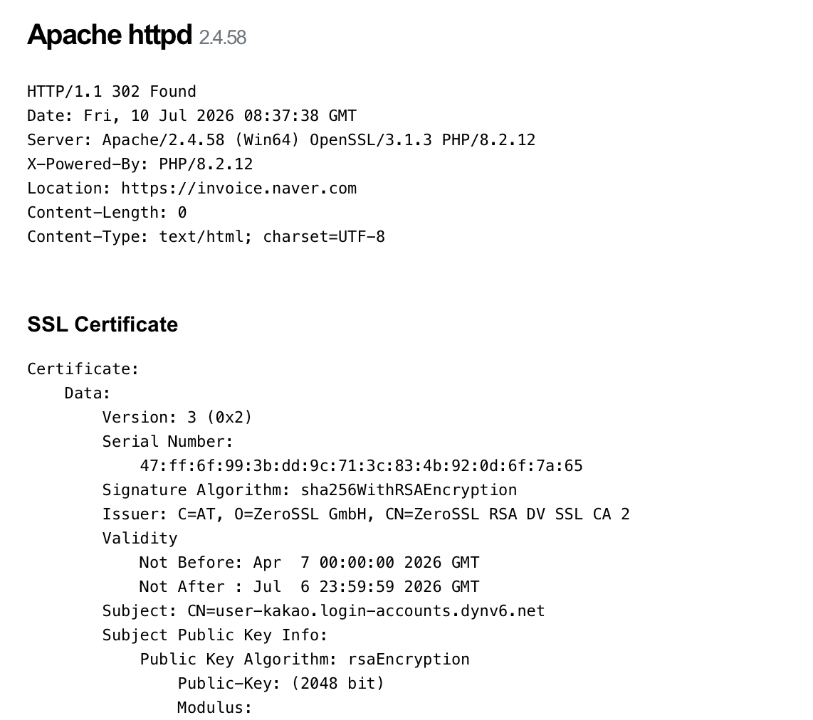

# Kimsuky Impersonations - A One Hour Hunt

So, back to a favorite - KR APT! This time, the goal was to only post what I could find in an hour, just to illustrate how much CAN be done once you've collated enough data.

Source of IOCs - [An excellent blog by Synaptic Systems] (https://blog.synapticsystems.de/inside-kimsukys-chm-tradecraft-multi-stage-execution-and-selective-payload-delivery/)


``` py title="Initial IOCs" 
51.79.185.184  
118.194.249.91  
```



118.194.249.91 has an interesting cert - Subject: CN=user-kakao.login-accounts.dynv6.net on cert, but the redirect is to https[:]//invoice.naver.com

``` py title="Modat query" 
same_service(web.html.mmh3=725371633)
```
This returns 152.32.138.15 as a new IOC.

Kimsuky have a trademark message that shows up on port 443 of their services. I've seen it for at least the last one year and so have others. 

```py title="Shodan Kimsuky query"
http.html:"Million OK !!!!" 
```

This returns another new IOC - 176.111.220.168.
Since Shodan displays the JARM, we can use that on Modat.

``` py title="Modat query #2" 
same_service(port=443 service="http" transport="tcp" cert.subject.cn="*kakao*") country="KR" cert.jarm=2ad2ad16d2ad2ad00042d42d00000061256d32ed7779c14686ad100544dc8d  
```

Our new IOC is 158.247.224.179, which has two big indicators:  
1. The ASN/org: AS 20473, The Constant Company, which is a Kimsuky favorite
2. domains seen on this IP - kakao.com-udoclist.dns.army


Let's try this one :

``` py title="Modat query #3" 
same_service(port=443 service="http" transport="tcp" cert.jarm=2ad2ad16d2ad2ad00042d42d00000061256d32ed7779c14686ad100544dc8d cert.subject.cn="*dns.army")
```
That yields 118.194.249.112.  

Now, for one last place to query, let's try urlscan. 

``` py title="Urlscan query" 
page.url:*.dns.army\/ country:"KR"  
```

So many urls with this pattern, several flagged, and several more. They're all mostly on the same 1-2 ASNs, which we've seen throughout this hunt. 

Urlscan results: 118.193.68.242, 118.193.68.11, 158.247.219.150, 123.58.200.69


A couple of these are flagged on VT as having been associated with Kimsuky in the past, so we're gucci. 

``` py title="New Hunting IOCs"
152.32.138.15  
176.111.220.168  
158.247.224.179  
118.194.249.112  
118.193.68.242   
118.193.68.11  
158.247.219.150  
123.58.200.69  
```

Interesting note: Kimsuky have now, it seems, started impersonating Naver/Kakao which are the biggest internet conglomerates in KR. It's like impersonating Google/Whatsapp. 

