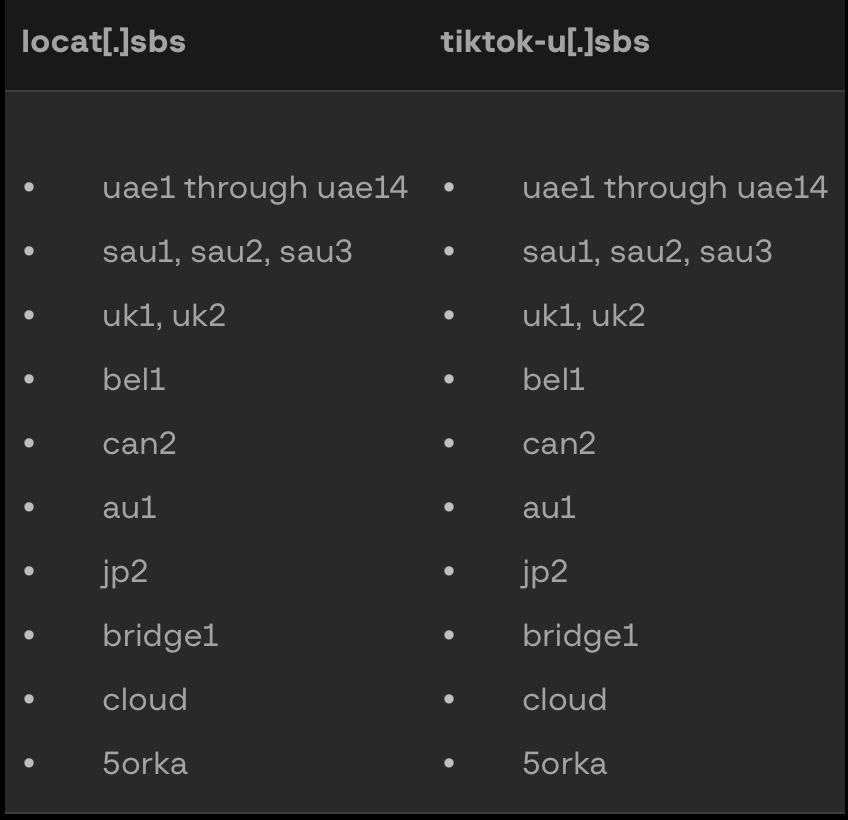

# Mirage Kitten / Nimbus Manticore - One Hour Hunt!

For today's quick one hour hunt, we'll look at some Iran-associated APTs. Our primary source for this is this excellent [Group-IB report](https://www.group-ib.com/blog/tortoiseshell-apt-toolset-infrastructure/).


There are a lot of interesting features on Modat, so that will be our primary source for the investigation. 

```py title=""
72.56.34[.]52
79.141.167[.]230
85.208.86[.]140
89.44.80[.]6
89.44.80[.]42
89.44.80[.]56 
89.44.80[.]61
89.44.80[.]86
89.44.80[.]96
89.44.80[.]168: 
89.44.80[.]234
91.193.16[.]187
94.126.227[.]20
94.126.227[.]119
95.85.235[.]9
95.174.68[.]199
139.84.202[.]187
167.179.89[.]68
172.86.98[.]113
185.66.68[.]213
185.253.116[.]71
185.253.116[.]81
185.253.116[.]99
185.253.116[.]166
185.253.116[.]242
185.253.118[.]246
188.119.149[.]200
```

We're also going to refer to this table for some additional information and domain info. 




