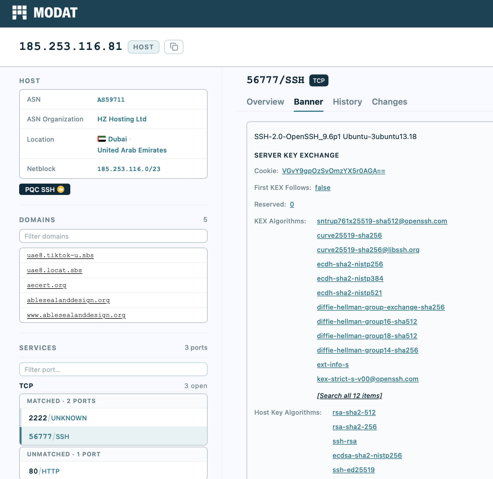
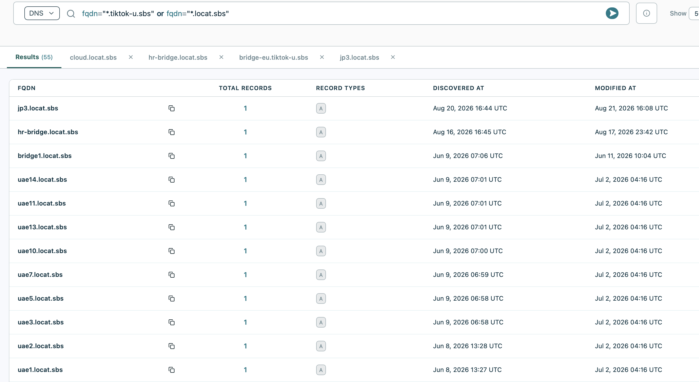

# Mirage Kitten / Nimbus Manticore - One Hour Hunt!

For today's quick one hour hunt, we'll look at some Iran-associated APTs. Our primary source for this is this excellent [Group-IB report](https://www.group-ib.com/blog/tortoiseshell-apt-toolset-infrastructure/).


There are a lot of interesting features on Modat, so that will be our primary source for the investigation. 

```py title=""
72.56.34[.]52
79.141.167[.]230
85.208.86[.]140
89.44.80[.]6
89.44.80[.]42
89.44.80[.]56 
89.44.80[.]61
89.44.80[.]86
89.44.80[.]96
89.44.80[.]168: 
89.44.80[.]234
91.193.16[.]187
94.126.227[.]20
94.126.227[.]119
95.85.235[.]9
95.174.68[.]199
139.84.202[.]187
167.179.89[.]68
172.86.98[.]113
185.66.68[.]213
185.253.116[.]71
185.253.116[.]81
185.253.116[.]99
185.253.116[.]166
185.253.116[.]242
185.253.118[.]246
188.119.149[.]200
```

We're also going to refer to this table for some additional information and domain info. 


Starting with one of these nodes, we can see port 2222, 80, and 56777. 
Normally, port 56777 as an SSH port could offer an interesting pivot point, but even though the banner is actually the same across all the nodes, the ssh server key fingerprint is unique to each, so the threat actors have been a little more careful with the Opsec there. 




We can also see port 2222 running TLS, and that means a cert that could be reused. However, they've been quite thorough - the serial number is unique, the Subject CN varies from node to node, and even though the majority of these nodes are running port 80/2222/56777, but the most useful port, 443 does not seem to be visible. 

However, there is ONE interesting pivot that works - The issuer CN, which has been reused. This suggests that the tooling used modifies most parts of the cert (eg. random subject common name), but uses the same issuer common name. 

A common way this is done is using a master CA keypair, which is used to sign all the servers deployed in this cluster.
This can be used to spin up VPS nodes quickly.

```py title="The query that gets them all"
same_service(port=2222 protocol="unknown" transport="tcp" tls.issuer.common_name="64cmXWWuUaT6bBXZ_Je1XnTWa_cz")
```

We get around 30 results. 
Excluding the ones that are already known, we get these:

```py title="New IP IOCs"
45.202.254.247 
46.8.21.174 
79.141.167.219   
178.105.227.127 
185.112.59.109 
193.221.200.247 
203.190.0.179 
185.253.116.188
```

There's another query we can run to identify a few more domains using the FQDNS.

```py title="FQDNS Query"
fqdn="*.tiktok-u.sbs" or fqdn="*.locat.sbs"
```



This returns a handful of other domains that were not found by Group-IB or Securelist before them. 

```
jp3.locat.sbs
hr-bridge.locat.sbs 
alice.tiktok-u.sbs 
bridge-eu.tiktok-u.sbs
```


Now, there are a few other things that are interesting, and possibly worth exploring:
1. A set of URLs that follow a similar setup with a common Issuer CN, but a different subdomain off the .sbs tld (cl1.ghostik.sbs, italy.ghostik.sbs, kdn.ghostik.sbs, belgium.ghostik.sbs, crix.ghostik.sbs), and also using the same port 2222 with port 80/56777 combos. None of these seem to be confirmed to be malware, but the pattern is interesting. 
2. lxnora.com, which is one of the set above, has a very obvious fake certificate
```
Signature Algorithm:
Issuer: C=US  ST=Denial  L=Springfield  O=Dis  CN=lxnora.com
```
Being in the State of Denial with the values of O=Dis clearly indicates a sense of humor along with some automated cert generation (O=Dis is a common default value), and the VT has a malicious .eml file (16 hits) communicating with this URL. Likely mal, not entirely certain it's this exact campaign. 

3. A few other candidates show up searching on the headers, which are inconclusive (asn.number=59711 asn.org="HZ Hosting Ltd" port=2222 protocol=unknown, for the curious). This is still a good way to generate candidates and to get a feel for what different hosts offer to their customers, whether it be a full /24 subnet at a time or the use of non-standard ports. 


```py title="High Confidence"
45.202.254.247 
46.8.21.174 
79.141.167.219   
178.105.227.127 
185.112.59.109 
193.221.200.247 
203.190.0.179 
185.253.116.188 
jp3.locat.sbs
hr-bridge.locat.sbs 
alice.tiktok-u.sbs 
bridge-eu.tiktok-u.sbs
```


```py title="Low Confidence" 
185.253.116.47 
185.253.116.91 
lxnora.com
```

