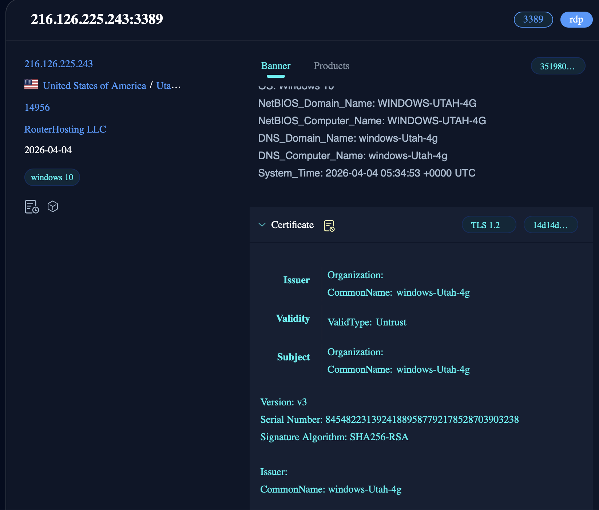
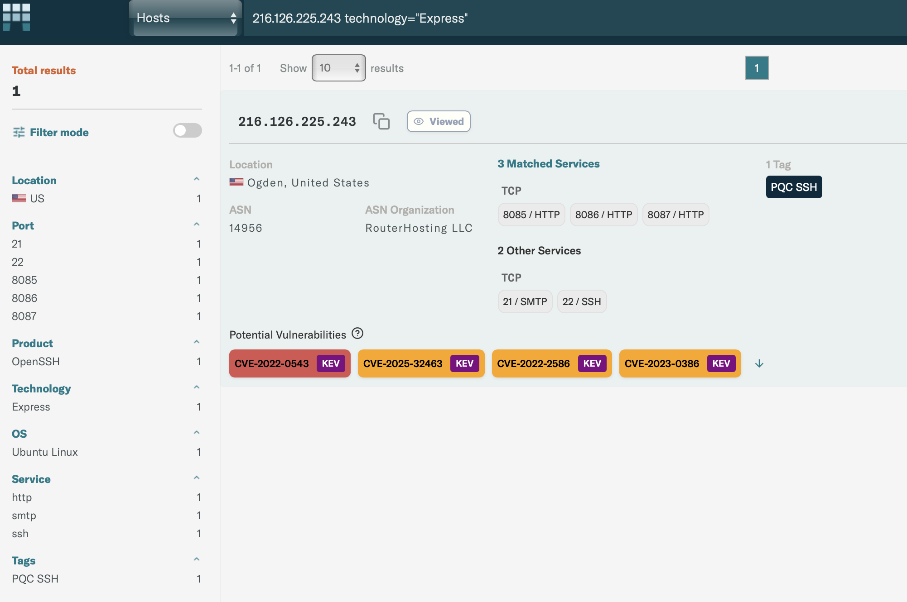

# Viva La Ottercookie! Well, not Really.

For this round of threat hunting using OSINT, we're starting off with some IOCs from threatfox associated with the ContagiousInterview campaign, and shaking off some rust. There's a new OSINT platform called Modat, and we're going to use Modat for a good portion of our work.


Click here to head to the [IOCs](# IOCs)! But remember, the devil is in the details...  


An important thing to remember is that each one of these OSINT engines (Censys, shodan, fofa, Modat, etc.) scans at a different time, so it's possible that no single engine has the entire picture - which is why we often pivot between engines, and update what we find as we go on.

``` py title="Initial IOCs"    
82.198.227.229:443  
144.172.94.202:8087  
216.126.225.243:8087  
```

From [this excellent blog](https://andrii.ro/blog/investigating-malware) dated a month ago, we can confirm some very interesting things
```
Port 8087; that's just the beacon.  
Port 8085/8086 are also used, but for uploads.  
```

We can use the presence of all 3 as a stronger indicator.  
  
---

**One big takeaway from this article - evaluating confidence in your IOCs is singularly important. You can find a million broken puzzle pieces, but you need to know which ones actually matter.**

For that, we'll try to build a hypothesis for each reasonable confidence interval.  

HIGH CONFIDENCE - Multiple pieces of information overlap with initial IOCs, active around the same time, possibly confirmed by 1-2 different engines. Here, we'll use the presence of all three ports, and the same ASN (14956). We might be able to add/subtract one thing for another (one port missing, but we have the same RDP service, etc). We can also use confirmations of known bad IPs from other domains eg. Virustotal/Urlscan.   
  

MEDIUM CONFIDENCE - Several parts of the overall hypothesis, but not all.   
  

LOW CONFIDENCE - 1/2 of the overall hypothesis, but nothing that would solidify our direction. Maybe just Port 8085 on the same ASN, for example.    


Anyway, to the hunt: 

```144.172.94.202-Routerhosting LLC (ASN 14956)``` has all 3 ports.
Let's use port 8087 headers first:

``` py title="Shodan query #1"
hash:-1246004407 port:8087 ASN:AS14956
```

As always, our process will be to determine the candidates first, and then use other sources to corroborate and weaken or strengthen our findings.  

``` py title="Candidates"
45.61.148.220  
104.194.134.213  
45.61.149.96  
144.172.89.180  
45.61.148.23  
107.189.20.237  
```

Checking 45.61.148.220 on Modat, we can see ports 8085 and 8086 have very specific headers that are consistent across these IPs. They're both running Express servers, and have consistent ContentLength responses(8085 has CTL-2, 8086 has CTL-21). Quite distinctive. 

Let's use that query on FOFA, and expand our list.  

``` py title="Phrase Shodan query on FOFA"
"HTTP/1.1 200 OK  Connection: close Content-Length: 2" && port=8085 && country="US" && asn="14956"
```
  


```py title="Fofa Candidates"
144.172.117.220  
216.126.237.163
167.88.167.54  
144.172.116.178  
45.61.148.23  
144.172.102.114  
216.126.239.135  
144.172.97.36  
216.126.239.233  
144.172.116.22 -> Flagged as Ottercookie on VT
```

Looking up our third initial IOC on FOFA (216.126.225.243), we can see that it also ran an RDP server with an interesting name. While the name itself is fairly common, we can use the RDP details as a further corroboration method - not confirmation, but a full picture of the services deployed. 




Modat is very interesting. As of the day this is written, it is quite similarly to what Censys used to be before the migration to a full-on service. Hold on to this for as long as you can! Modat also lets you filter which ports offered a specific type of service (Express, here, which lets us just look at the ones we're interested in first).


    

```py title="Modat Query"
asn=14956 and technology="Express" and port=8085 and port=8086 and port=8087
```

But here's an alternate route. Pick any of the matches here, with valid port 8087, and you can search based on the Murmurhash of that banner. 
An interesting thing Modat lets you do is to create a new query, and adds all the parameters in. Quite nifty. 

```py title="Sample using murmurhash of banner on port 8087"
asn=14956 same_service(port=8087 service="http" transport="tcp" technology="Express" web.html.mmh3=-713974371)
```


```py title="Modat Candidates"
172.86.123.37  
216.126.237.163  
172.86.126.76  
45.61.148.220  
167.88.167.54  -> Flagged as malware on Virustotal, but for malicious-supply-chain
144.172.117.220  -> Famous chollima tag on VT
104.194.153.144  
107.189.20.237  
104.194.134.213  
107.189.20.115  
107.189.22.20  -> Flagged by Maltrail as Lazarus
144.172.89.180  
172.86.73.27  
144.172.94.202  -> Initial IOC
216.126.225.243  
216.126.239.233  
144.172.116.178  
45.61.149.96  
144.172.97.36  

```

This, overall, is pretty comprehensive. If you so desired, there are other IOCs you can use - variants of Issuer CN on the TLS cert RDP port 3389 (windows-utah-1g/2g/4g), the majority of these IPs also run SSH-2.0-OpenSSH_9.6p1 Ubuntu-3ubuntu13.16 on port 22, etc. 
Feel free to play around and find more interesting stuff!


#IOCs:
**High Confidence**:  
167.88.167.54, 107.189.22.20, 216.126.225.243, 104.194.153.144, 216.126.237.163, 172.86.123.37, 107.189.20.237, 107.189.20.115, 144.172.89.180, 172.86.73.27, 216.126.239.233, 144.172.116.178, 104.194.134.213, 144.172.117.220, 144.172.97.36, 144.172.116.22

**Medium Confidence**:  
45.61.148.23, 144.172.102.114, 216.126.239.135

Note - 144.172.116.22 would normally be considered low confidence. The different engines don't have all of the port info, and the cloudzy-RDP naming for windows nodes is present. EXCEPT, this node is flagged on VT as confirmed Ottercookie. That alone pushes it up significantly. 


Thanks for reading, and definitely give Modat a shot. It's pretty comprehensive. 


