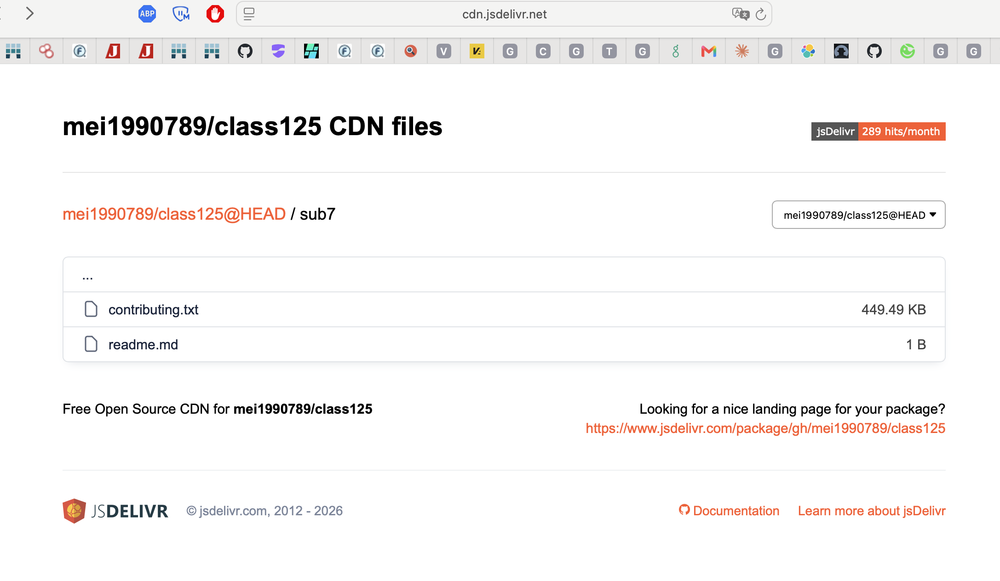
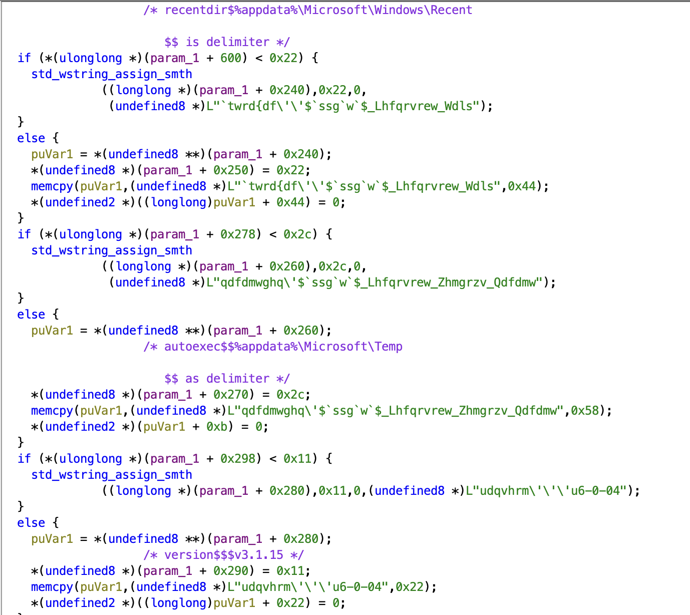
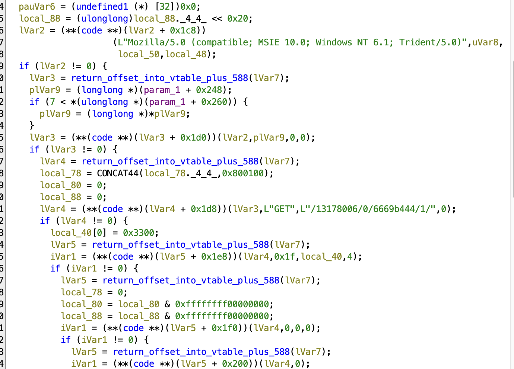
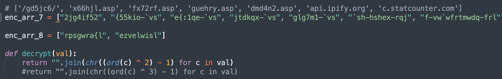
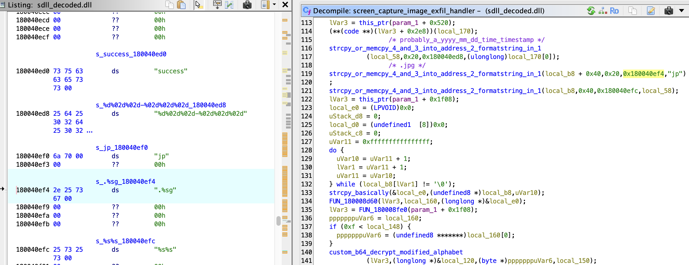
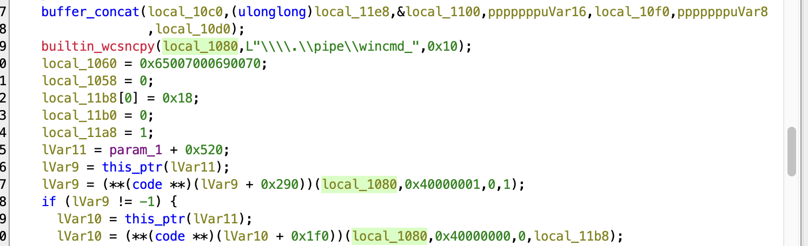
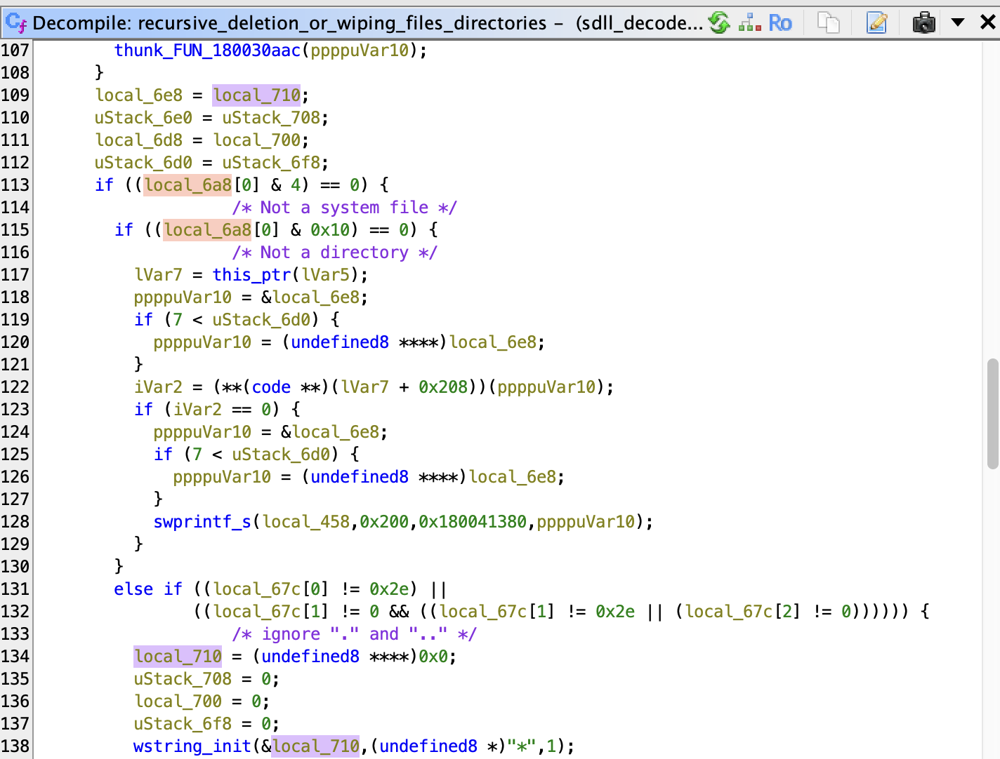
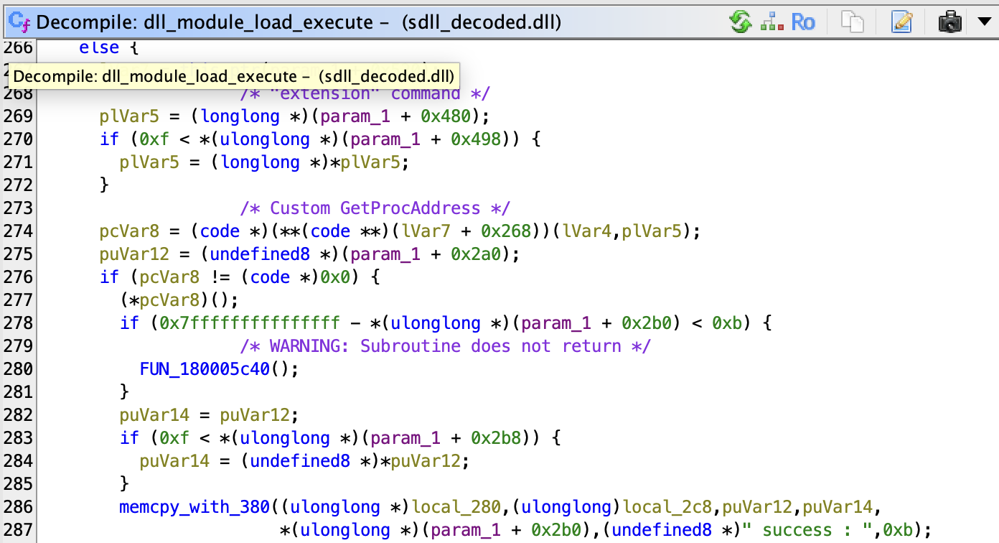
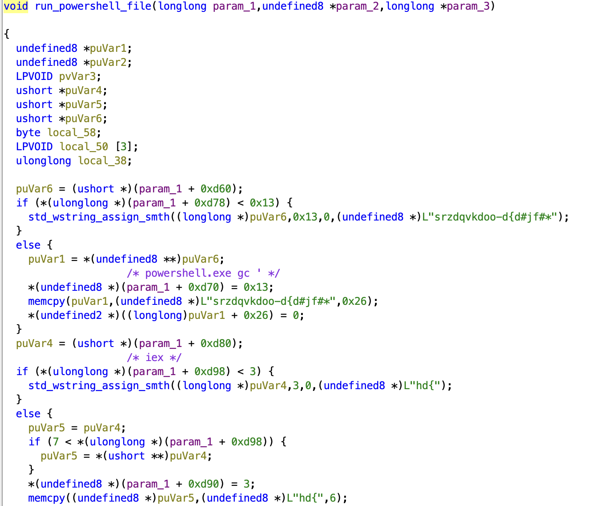
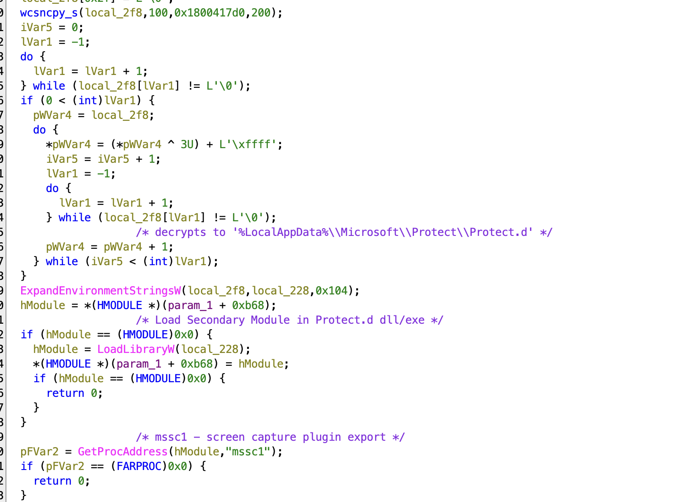

# APT-C-60 Attacks Japanese Organizations Using SpyGlace Backdoor Capabilities


## Introductory Analysis:

This edition of threat hunting/analysis will be delving into reverse engineering some malware we were able to obtain - SpyGlace v3.1.15. SpyGlace is a Windows backdoor attributed to APT-C-60, targeting Japanese entities. The objective of this analysis will be restricted to purely static reversing, so minimal dynamic data will be obtained in this way, only referencing public sandboxing for relevant data. 

Appendix E of the source blog: [https://blogs.jpcert.or.jp/en/2026/07/apt-c-60_2026.html](https://blogs.jpcert.or.jp/en/2026/07/apt-c-60_2026.html), contains a number of github pages which are still active, and I was able to obtain a number of the files. 

```
https[:]//cdn.jsdelivr[.]net/gh/mei1990789/class125/
```



This opendir contains several files - one base64 encoded payload in sub7/contributing.txt (449.49KB) - this eventually decodes to SpyGlace v3.1.15. 

One of the files I captured had a sha256 that matched a known one from the JP cert blog, but the file itself was garbled/encoded data. BUT the bytes repeated, which determined that this file was XOR-encrypted, and the 20 byte repetition suggested that was the length of the key. The XOR key was appended to the head of the file ("sgznqhtgnghvmzxponum"), and when XOR-ed, we see the first few bytes are 4D 5A 90 00 (MZ header).


## Technical Overview: SpyGlace v3.1.15 Evolution

SpyGlace contains functionalities to perform screen captures, kill existing processes, exfiltrate system data, and file system wiping. It also uses a named pipe for real-time command dispatch from the C2 server, and supports loading additional DLL beacons from the C2 with other unnamed capabilities. Where JPCERT's July 2026 report found no major functional differences across v3.1.15–3.1.18, my analysis of this v3.1.15 sample surfaced a few features that, to the best of my knowledge, don't appear in any public analyses, new or old.


### Key Findings:
1. Interactive Named-Pipe IPC (\\\\.\pipe\wincmd_*): Decouples command execution from single-shot cmd.exe /c processes, maintaining persistent standard I/O streams across commands. 

2. Structured C2 Wire Protocol: Employs parameter multiplexing across three distinct functional pipelines (command execution logs, single-transaction screenshots, and multi-part chunked file uploads).

3. Strict Staging Constraints: Requires secondary payloads from the C2 to pass an explicit .ace container check, multi-layer decoding (RC4 → Base64 → hex decode → in-place byte reversal), deliberately breaking tools that expect standard PE/shellcode byte ordering in transit.

4. Can use fileless invocation using CreateStreamOnHGlobal, which is loaded dynamically from ole32.dll, alternatively staging payloads briefly through a fixed temp path (%temp%\wcts66889.tmp) before file deletion. Each loaded plugin has an 'extension' export to start, and a 'stopextension' export used to kill the DLL. 

5. Disguised Companion Plugins (Protect.db): Dynamically loads a hidden companion library dropped to %LocalAppData%\Microsoft\Protect\Protect.db to orchestrate surveillance features like screen capture.

6. The sample resolves all Windows APIs via manual PEB/export-table walking and encrypted string comparisons, not the IAT - only KERNEL32.dll appears as a static import. 


## Technical Analysis:

### File Analysis - Static:

```
SHA256 (Decoded file): 7621e4eff855b2679188b33fe4c71c377f6e2d0b9c25d939452e18992c52e067

file sdll_decoded.dll 
sdll_decoded.dll: PE32+ executable (DLL) (GUI) x86-64, for MS Windows 
```

#### Architecture & API Resolution:
SpyGlace coordinates execution through a monolithic C++ object spanning over 40 KB (>0x9F00 bytes). APIs are resolved dynamically in memory using multiple decryption mechanisms to resolve: 

- C2 commands 

- Target ASP pages 

- WinHTTP API Functions 

- Hardware, BIOS, and Locale Evasion/Fingerprinting Checks 

- File paths for staging and persistence 

It uses PEB-walking and Export-Directory Parsing to dynamically resolve Windows APIs at runtime without exposing values in its Import Address Table. Since this is a 64-bit program, the call to gs:[0x60] points to the PEB, and offset 0x18 targets LDR_DATA. Offset 0x20 into LDR_DATA yields the InMemoryOrderModuleList, which is traversed to iterate over every loaded module in memory. This is compared against an encoded version of the target DLL's name, which is decrypted strictly at runtime.

The dynamically imported DLLs include: 
```
ole32.dll 
winhttp.dll  
advapi32.dll  
shlwapi.dll 
```

Functions imported from these DLLs are obfuscated using arithmetic ciphers of the form (c⊕key)−sub:
```
Plaintext(c)=((c⊕3)−1)  
or 
Plaintext(c)=((c⊕2)-1) 
```


Notably, for winhttp.dll exports, SpyGlace employs a pairwise consonant-transposition cipher (e.g., [ilJvvrSrel decodes to WinHttpOpen, and [ilJvvrWevSrvisl decodes to WinHttpSetOption). 


#### Environmental Fingerprinting & Persistence:
Multiple evasion checks query the Windows registry to fingerprint the host environment, these are also used as part of the beacon to Statcounter:

- Processor Name
"HARDWARE\\DESCRIPTION\\System\\CentralProcessor\\0", "ProcessorNameString"
- BIOS
"HARDWARE\\DESCRIPTION\\System\\BIOS", "SystemManufacturer"
- Architecture through Environment Variables
"SYSTEM\\CurrentControlSet\\Control\\Session Manager\\Environment"
- Registry Queries for System Language under HKLM
"SYSTEM\\CurrentControlSet\\Control\\Nls\\Language", "InstallLanguage"
- Registry checks for Operating System including Service Pack Level
"CSDVersion", "InstallDate", "ProductName"

The malware writes itself to registry autostart keys to establish persistence and drops its internal version string (v3.1.15) as a registry value - which are artifacts worth looking for.




#### Network Communication: 

SpyGlace initiates network communication via the following sequence: 

```
1. Egress IP Profiling: Connects to api.ipify.org over TLS to retrieve the host's public IP address before staging check-ins. 
2. StatCounter Telemetry Channel: Retains protocol impersonation of legitimate tracking pixels to blend into analytics traffic. 
Format: /<project_id>/0/<security_code>/1/ 
3. The core payload reaches out to an origin C2 - 31.58.136.207 (Virustotal confirms this,tagged by JP-cert). Specifically, it cycles through several ASP mesh pages hosted within the /gd5jc6/ directory:
Active C2 endpoints: x66hjl.asp, fx72rf.asp, guehry.asp, dmd4n2.asp 
```





During request construction, the implant invokes WinHttpSetOption on the active request handle, ignoring certificate validity issues and communicating through any interception proxies using option 0x1f (WINHTTP_OPTION_SECURITY_FLAGS) and a value mask of 0x3300. 


#### C2 Communication Protocols: 

We observed 3 distinct dispatch mechanisms based on the C2 communication type: 
- System Command Execution & Progress Logging 
- Single-Transaction Screenshot Exfiltration 
- Multi-Part Chunked File Exfiltration / Upload Engine 


Inbound C2 tasks are validated by decrypting the 8-byte prefix "additive" before stripping and parsing commands. When communicating outboard, payloads are formatted as application/x-www-form-urlencoded parameters:

The following parameters are sent during any form of communication: 
c001 = Persistent Implant UID 
c002 = Deterministically generated hardware/system fingerprint MD5 
c003 = Action Verb 
c004 = RC4 encrypted log/base64 filename 
 
"&c007=true" is appended only in case of exfiltration.



#### Interactive Shell:

CreateProcessW is called for cmd.exe /c with the STARTUPINFO struct modified so that hStdInput, hStdOutput, and hStdError are bound directly to the \\.\pipe\wincmd_* handle. This sets up the interactive C2 shell.
The inclusion of attach and detach allows the operator to maintain persistent standard input/output streams via named pipes (\\.\pipe\wincmd_*) without repeatedly spawning cmd.exe processes. To my knowledge, the inclusion of named pipes is something that has not been previously reported upon for SpyGlace. 




SpyGlace is also able to wipe a directory or file as needed after exfiltration, and leaves system files so as not to disrupt ordinary operations.



#### Staging & Payload Refinements:
Before loading secondary modules or executing downloaded tasks, the binary parses the filename, performs a reverse search for the extension delimiter (.), and enforces an explicit match against .ace. Any stage not bearing the .ace extension is discarded. This .ace file is then extracted and inner .dll, .dat, .exe, .db files can be run as additional plugins/stages using rundll32. The malware also supports fileless memory loading for remote PowerShell scripts.





For desktop surveillance, the malware targets %LocalAppData%\Microsoft\Protect\Protect.db. It loads a specific DLL via LoadLibraryW, and calls unmanaged export "mssc1". The resulting raw screen capture is saved as <YYYYMMDD_HHMMSS>.jpg, encrypted, and posted to the C2.



The secondary payloads are decoded using a full RC4 implementation that SpyGlace contains, where the command/response data is encrypted, then converted to Base64, and then undergo hex decoding using CRT strtoul(..., 16) followed by an in-place byte reversal prior to execution. This routine swaps endianness across the entire decoded buffer, neutralizing static network extraction tools that expect standard byte-ordered shellcode or PE headers.

```
iVar2 = memcmp(_Buf1, "ace", 3); 
if ((iVar2 == 0) && (uVar7 == 3)) { 
    return 1; // Valid payload container 
} 
```

SpyGlace utilizes a dynamically resolved CreateStreamOnHGlobal pointer from ole32.dll to allocate the virtual memory stream for fileless .ace execution before scrubbing the temp file. This allows it to avoid requesting the highly scrutinized PAGE_EXECUTE_READWRITE permissions and the VirtualAlloc API, as well as blending into more standard COM operations.
This temp file is always written to "%temp%\\\\wcts66889.tmp".


It uses two instances of the same S-box set up mechanism, one for the fetch task-execute loop and another for the files downloaded from the remote beacon. This is because RC4 is a stateful stream cipher - which means it can't be reused between the two tasks. The main C2 beaconing loop (fetching tasks/payloads) and the named-pipe interactive shell operate asynchronously.

### C2 Command List & Named Pipe IPC

|Command| Type|Behavior|
| :---: | :---: |:---: |
| `procspawn` | Process | Spawn child process via native API |
| `proclist` | Process |  (inactive from v3.1.14 stubs) |
| `prockill` | Process | (inactive from v3.1.14 stubs) |
| `diskinfo` | Discovery | Enumerate disk drives, filesystem type, available space |
| `downfree` | Staging | Retrieve payload from C2 and write to disk |
| `download` | Staging | Download encrypted payload, execute from %temp% and delete |
| `upload` | Exfiltration | Exfiltrate target file to C2 |
| `cancel` | Control | Abort active data transfer or pipeline execution |
| `cmd` | Shell | Spawn interactive shell |
| `attach` | IPC | Start module|
| `detach` | IPC | Stop module |
| `screenupload` | Surveillance | Invokes Protect.db DLL(mssc1 export) and posts timestamped .jpg to C2|
| `screenauto` | Surveillance | Initialize automated periodic screenshot capture |
| `cd` | Filesystem | Change working directory |
| `ddir` | Filesystem | Enumerate directory contents |
| `ddel` | Filesystem | Recursive File and Directory Wiping |
| `ld` | Modules | Load DLL plugin using GetProcAddress |
| `uld` | Modules |Unload DLL plugin using GetProcAddress |
| `turn on` | Networking | Change Communication Interval Settings |
| `turn off`| Networking  | Reset Interval Settings |


## Indicators of Compromise (IoCs):

|IOC Type| IOC Value| Notes|
| :---: | :---: | :---: |
|URL|api.ipify.org|Egress profiling|
|URL|c.statcounter.com/13178006/0/6669b444/1/|Different from the one observed by JP-cert - /13178005/0/7f3c2735/1/|
|C2 IP|31.58.136.207| ID'd by JP-Cert - this one was contacted by this specific sample| 
|Endpoint|/gd5jc6/x66hjl.asp ||
|Endpoint|/gd5jc6/fx72rf.asp ||
|Endpoint|/gd5jc6/fx72rf.asp ||
|Endpoint|/gd5jc6/guehry.asp ||
|Endpoint|/gd5jc6/dmd4n2.asp ||
|Named Pipe|\\.\pipe\wincmd_* ||
|Staged Containers|.ace||
|Filesystem Path|%LocalAppData%\Microsoft\Protect\Protect.db ||
|Mutex|K31610KIO9834PG79787|Decrypts to H02321HJL:905QD4:494||


## Mitre ATT&CK Mappings:
T1497.001 - Virtualization/Sandbox Evasion: System Checks 

1082 - System info discovery 

T1547.001 - Run key persistence 

T1071.001 - Web C2 

T1027 - Obfuscated files/API resolution 

T1102.002 - Web Service: Bidirectional Communication 

T1485 - Data destruction 

T1140 - Deobfuscate/Decode Files or Information 

T1620 - Reflective Code Loading 

T1573.001 - Encrypted Channel: Symmetric Cryptography 

T1559.002 - Inter-Process Communication: Named Pipe 

T1119 - Automated Collection 

T1041 - Exfiltration Over C2 Channel 

T1564.001 - Hide Artifacts: Hidden Files and Directories 

T1218.011 - System Binary Proxy Execution: rundll32 

T1059.001 - Command and Scripting Interpreter: PowerShell 

T1106 - Native API 


## Yara Rule:

```
rule APT_C_60_SpyGlace_v3_1_15 {
    meta:
        description = "Detects SpyGlace v3.1.15 backdoor artifacts and runtime strings"
        author = "Vishwa Thothathri"
        date = "2026-09-21"
        reference = "https://blogs.jpcert.or.jp/en/2026/07/apt-c-60_2026.html"
        hash = "7621e4eff855b2679188b33fe4c71c377f6e2d0b9c25d939452e18992c52e067"
    strings:
        $pipe = "\\\\.\\pipe\\wincmd_" ascii wide

        // Obfuscated additive verification tag: `gghwhud
        $additive = { 60 67 67 68 77 68 75 64 }
        $xor = { 66 83 f0 02 66 ff c8 }
        $ace = "ace" ascii
        $export = "mssc1" ascii
        $cmd_turn_on = "vupl\"sl" ascii
    condition:
        uint16(0) == 0x5A4D and
        (5 of them)
}
```


